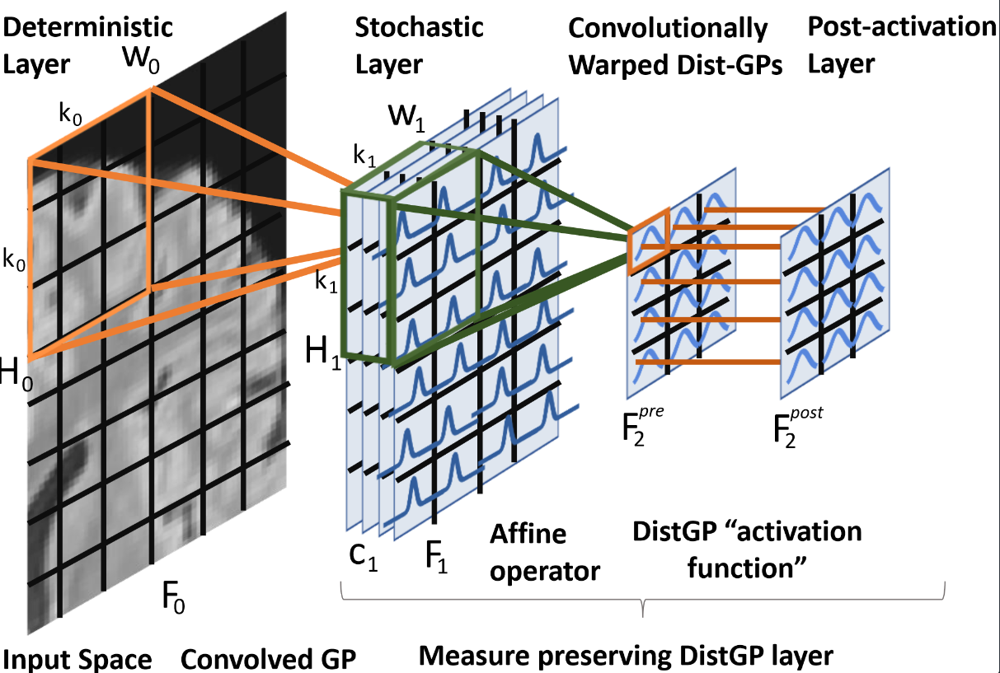
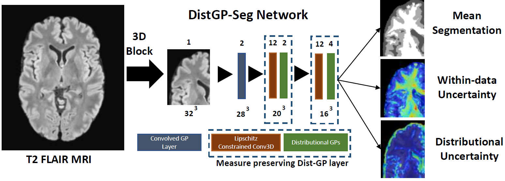

# Under construction

>📋  Accompanying code for "Distributional Gaussian Process Layers for Outlier Detection in Image Segmentation"

# Distributional Gaussian Process Layers for Outlier Detection in Image Segmentation

This repository is the official implementation of [Distributional Gaussian Process Layers for Out-of-Distribution Detection](https://link.springer.com/chapter/10.1007/978-3-030-78191-0_32). 

>📋  

>📋  

## Requirements

To install requirements:

```setup
pip install tensorflow-gpu
```
## Training

To train the model in the paper, run this command:

```train
/vol/biomedic2/sgp15/anaconda3/bin/python3 Brain_Seg.py --num_layers=4 --dim_filter=5 --dim_layers=2 --num_inducing=250 --num_iterations=50001 --dim_convolutionally_warped_gp=12 --path_input_scans=$path_input_scans --path_output_scans=$path_output_scans --path_example_scan=$path_example_scan --dataset_name=$dataset_name --dim_output=$dim_output
```

>📋  The above command line function start training the DistGP Seg model provided a dataset to segment. The following parameters have to be specified by the user:<br/>
> $path_input_scans : absolute path of folder containing scans that are to be segmented<br/>
> $path_output_scans : absolute path of folder containing manually segmented scans<br/>
> $path_example_scan : absolute path of a random input scan from your dataset<br/>
> $dataset_name : name of your dataset<br/>
> $dim_output : number of segmentation classes

## Citing this work

>📋 If you use this probabilistic formulation in your publications, please consider citing the accompanying paper with a BibTeX entry similar to the following:

```
@InProceedings{10.1007/978-3-030-78191-0_32,
author="Popescu, Sebastian G.
and Sharp, David J.
and Cole, James H.
and Kamnitsas, Konstantinos
and Glocker, Ben",
editor="Feragen, Aasa
and Sommer, Stefan
and Schnabel, Julia
and Nielsen, Mads",
title="Distributional Gaussian Process Layers for Outlier Detection in Image Segmentation",
booktitle="Information Processing in Medical Imaging",
year="2021",
publisher="Springer International Publishing",
address="Cham",
pages="415--427",
abstract="We propose a parameter efficient Bayesian layer for hierarchical convolutional Gaussian Processes that incorporates Gaussian Processes operating in Wasserstein-2 space to reliably propagate uncertainty. This directly replaces convolving Gaussian Processes with a distance-preserving affine operator on distributions. Our experiments on brain tissue-segmentation show that the resulting architecture approaches the performance of well-established deterministic segmentation algorithms (U-Net), which has never been achieved with previous hierarchical Gaussian Processes. Moreover, by applying the same segmentation model to out-of-distribution data (i.e., images with pathology such as brain tumors), we show that our uncertainty estimates result in out-of-distribution detection that outperforms the capabilities of previous Bayesian networks and reconstruction-based approaches that learn normative distributions.",
isbn="978-3-030-78191-0"
}


```


